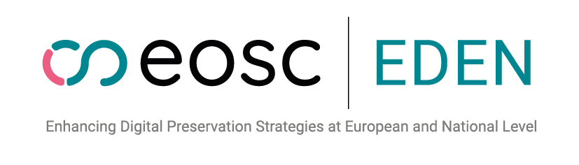

# Core Preservation Processes

## Definition

A Core Preservation Process (CPP) is a specific action that every Trustworthy Digital Archive should undertake adequately - either directly or through its associated parties or services, in order to fulfill its digital preservation missions as evidenced in its preservation policy.

The following assertions define the scope of CPPs:

* They focus on the operational activities required by digital preservation (understood as covering short- to long-term preservation) and do not cover strategic/managerial digital preservation activities nor the whole list of activities of a generic information management system, including  secure IT infrastructures.

* Though digital preservation requires a deep knowledge of the properties, structure and possible uses of digital objects, which can be domain or discipline specific, the scope of CPP is limited to generic processes that take place in general when performing digital preservation regardless of specific content, domain or discipline.

* The list of CPPs and their description are established by a group of digital preservation practitioners. In addition, consensus within the digital preservation community about this list will be evidenced by references to prominent maturity models, self-assessment, and certification frameworks used by said community.

* CPPs are described as a sequence of implementable steps, either by humans or by automation.

## List of Core Preservation Processes

You can access individually the last version of  each Core Preservation Process through the following links:
* [CPP-001 Checksum Generation and Recording](cpp-001.html)
* [CPP-002 Checksum Validation](cpp-002.html)
* [CPP-003 Integrity Checking](cpp-003.html)
* [CPP-004 Data Corruption Management](cpp-004.html)
* [CPP-005 Identifier Management](cpp-005.html)
* [CPP-006 AIP Batch Export](cpp-006.html)
* [CPP-007 Virus Scanning](cpp-007.html)
* [CPP-008 File Format Identification](cpp-008.html)
* [CPP-009 Metadata Extraction](cpp-009.html)
* [CPP-010 File Format Validation](cpp-010.html)
* [CPP-011 Replication](cpp-011.html)
* [CPP-012 Risk Mitigation](cpp-012.html)
* [CPP-013 Object Management Reporting](cpp-013.html)
* [CPP-014 File Migration](cpp-014.html)
* [CPP-015 Emulation and Rendering Tools](cpp-015.html)
* [CPP-016 Metadata Ingest and Management](cpp-016.html)
* [CPP-017 Disposal](cpp-017.html)
* [CPP-018 Community Watch](cpp-018.html)
* [CPP-019 Data Quality Assessment](cpp-019.html)
* [CPP-020 Rights Management](cpp-020.html)
* [CPP-021 AIP Versioning](cpp-021.html)
* [CPP-022 Significant Properties Definition](cpp-022.html)
* [CPP-023 Risk Properties Definition and Extraction](cpp-023.html)
* [CPP-024 Enabling Discovery](cpp-024.html)
* [CPP-025 Enabling Access](cpp-025.html)
* [CPP-026 File Normalisation](cpp-026.html)
* [CPP-027 File Repair](cpp-027.html)
* [CPP-028 Creation of Derivatives](cpp-028.html)
* [CPP-029 Ingest](cpp-029.html)
* [CPP-030 Refreshment](cpp-030.html)

## Visualisation tool

The [CPP Visualisation tool](https://eosc-eden.github.io/wp1-cpp-visualization) allows you to explore the relationships that exists between the CPPs.

The tool groups the CPPs in one of two selectable classification schemas and allows you to filter on relation types. The graph can be clicked-through
to deep-dive into the relations and related CPPs.

Next to the graph, the tool also provides a grid representation where you have an overview of all source and target CPPs and their relationships. You 
can click on a box to see the relationship details and access the descriptions of the CPPs on either end of the relation.

## Contribution and Discussion

Do you have feedback or questions?  EOSC EDEN warmly welcomes your thoughts on the CPPs. Please engage in the discussion through our Github repository:

* ***[https://github.com/EOSC-EDEN/wp1-cpp-descriptions](https://github.com/EOSC-EDEN/wp1-cpp-descriptions)***

## Zenodo Publication

You can also refer to the CPPs in an earlier version by citing this Zenodo publication:
* EOSC EDEN T1.2, Micky Lindlar, Bertrand Caron, et al. M1.1 Report on Identification of Core Preservation Processes. Zenodo, 2025. https://doi.org/10.5281/ZENODO.16992451.
